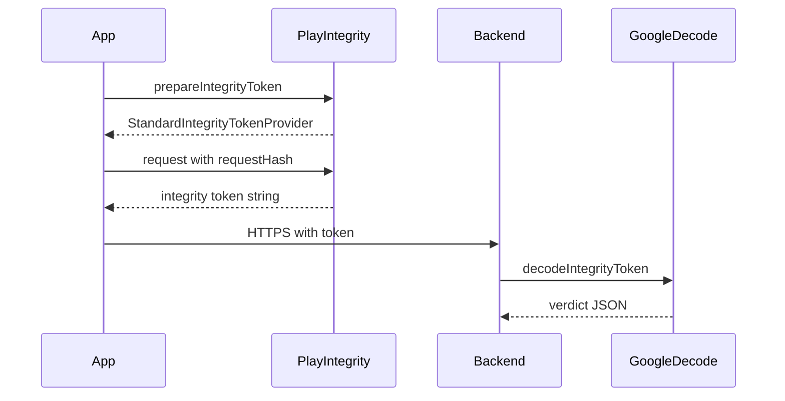

# Android Security

**Agent read contract:** Open [android-security-quick.md](android-security-quick.md) first. Read only the section you need below (use the table of contents). Stop after that section unless the task needs Play Integrity setup, checklists, or full code samples here.

Forbidden: load this entire file when the quick file plus one section cover the task.

Required: server is the trust boundary; the client only collects credentials and forwards integrity tokens. Layer Play Integrity (server-decoded) + Android Keystore + EncryptedSharedPreferences/EncryptedFile + network security config. Heuristic root/emulator checks are telemetry only - never the sole gate.

## Table of Contents
1. [Device trust and abuse resistance](#device-trust-and-abuse-resistance)
2. [Network Security](#network-security)
3. [Certificate Pinning](#certificate-pinning)
4. [Data Encryption at Rest](#data-encryption-at-rest)
5. [Android Keystore, TEE & StrongBox](#android-keystore-tee-strongbox)
6. [Biometric Authentication](#biometric-authentication)
7. [Credential Manager and Sign-In](#credential-manager-and-sign-in)
8. [Device Identifiers and Privacy](#device-identifiers-and-privacy)
9. [Android 15+ Platform Privacy](#android-15-platform-privacy)
10. [Play Console Data Safety](#play-console-data-safety)
11. [Play Integrity API](#play-integrity-api)
12. [Root & Emulator Detection](#root-emulator-detection)
13. [Screenshot & Screen Recording Prevention](#screenshot-screen-recording-prevention)
14. [Secure Database (Room)](#secure-database-room-3)
15. [Secure Clipboard](#secure-clipboard)
16. [WebView Security](#webview-security)
17. [Content Provider Security](#content-provider-security)
18. [ProGuard / R8 Hardening](#proguard-r8-hardening)
19. [CI/CD Security](#cicd-security)
20. [Security Checklist](#security-checklist)

## Dependencies

Security-related libraries available in the version catalog:

- `androidx-biometric` - BiometricPrompt (fingerprint, face)
- `androidx-security-crypto` - EncryptedSharedPreferences, EncryptedFile
- `play-integrity` - Play Integrity API (device/app attestation)
- `sqlcipher-android` - SQLCipher for encrypted Room databases

Add them to your module as needed, following [dependencies.md → Adding a New Dependency](dependencies.md#adding-a-new-dependency).

## Device trust and abuse resistance

Apply for high-value flows: login, payment, account change. Establish that *this app binary* on *this device* is trustworthy *for this specific request* - not a single client-side boolean.

### Client-only heuristics are insufficient

Local `su` / Magisk / package checks are evadable and tamperable. Use them only as telemetry. Never treat "root detected" / "not detected" as the sole authorization signal.

### Trust inputs (server-verifiable)

- App binary matches what Play expects (**app integrity**).
- Install/account context is legitimate (**licensing / account signals**).
- Device environment meets policy (**device integrity** and optional signals).
- Integrity token binds to this exact server request (`requestHash` for Standard API, `nonce` for Classic - see [Play Integrity API](#play-integrity-api)).

[Play Integrity API](https://developer.android.com/google/play/integrity/overview) emits these as server-verifiable signals.

### Implementation order

1. Backend is authoritative. Decrypt/verify tokens server-side; apply **tiered** policy (allow / step-up / rate-limit / deny the specific operation). Never let the client be the only enforcer.
2. Use Play Integrity for Play-distributed apps. Integrate **Standard** for frequent checks (prepare provider, request with `requestHash`); use **Classic** for rare high-value checks (`nonce`). See [Play Integrity API](#play-integrity-api).
3. Bind every token to the action: hash a canonical request representation. Never put secrets in plaintext into the hash input.
4. Roll out enforcement gradually: log verdicts first, then tighten rules.
5. Combine with Android Keystore-backed keys for device-bound signing/encryption of high-value operations (see [Android Keystore, TEE & StrongBox](#android-keystore-tee-strongbox)).
6. Treat optional runtime signals (overlays, accessibility abuse, automation) as risk inputs to policy/fraud engines - not the sole gate unless product requires it.

Reference: [Play Integrity API overview](https://developer.android.com/google/play/integrity/overview).

## Network Security

### Network Security Configuration

At target SDK 37, `android:usesCleartextTraffic` defaults to `false` and every HTTP request fails without a Network Security Config domain allowlist. Production: leave the manifest attribute absent or `false` and rely on the implicit deny. Dev/test: scope cleartext to a single `<domain-config>` for the local backend, never to the whole app.

Create `res/xml/network_security_config.xml`:

```xml
<?xml version="1.0" encoding="utf-8"?>
<network-security-config>
    <!-- Block all cleartext (HTTP) traffic -->
    <base-config cleartextTrafficPermitted="false">
        <trust-anchors>
            <certificates src="system" />
        </trust-anchors>
    </base-config>

    <!-- Debug overrides (only in debug builds) -->
    <debug-overrides>
        <trust-anchors>
            <certificates src="user" />
        </trust-anchors>
    </debug-overrides>
</network-security-config>
```

Reference in `AndroidManifest.xml`:

```xml
<application
    android:networkSecurityConfig="@xml/network_security_config"
    ... >
</application>
```

### Certificate Transparency (API 37)

At target SDK 37, Certificate Transparency is enforced by default for every HTTPS connection routed through the platform stack. Per-domain opt-out is reserved for endpoints whose certs are issued by a non-public CA (internal corporate CAs, captive portals); never disable globally.

```xml
<!-- res/xml/network_security_config.xml -->
<domain-config>
    <domain includeSubdomains="true">internal.example.com</domain>
    <ct-policy enabled="false" />
</domain-config>
```

Forbidden: a global `<base-config><ct-policy enabled="false"/></base-config>` (disables CT for every domain and undoes the platform default).

### Loopback access (API 37)

Apps targeting Android 17 must declare `android.permission.USE_LOOPBACK_INTERFACE` to reach `127.0.0.1` / `::1` from another app's process. Same-process loopback (instrumented tests against `MockWebServer` in the test process) is unaffected.

```xml
<uses-permission android:name="android.permission.USE_LOOPBACK_INTERFACE" />
```

Required only for: cross-process bridges to a local Web/Node/HTTP server (custom dev shells, Detox-style test harnesses). Production apps that only talk to remote HTTPS endpoints do not need this permission.

### OkHttp Security Configuration

```kotlin
// core/network/di/NetworkModule.kt
@Module
@InstallIn(SingletonComponent::class)
object NetworkModule {

    @Provides
    @Singleton
    fun provideOkHttpClient(): OkHttpClient {
        return OkHttpClient.Builder()
            .connectTimeout(30, TimeUnit.SECONDS)
            .readTimeout(30, TimeUnit.SECONDS)
            .writeTimeout(30, TimeUnit.SECONDS)
            // TLS 1.2+ only (default on API 24+, but explicit is better)
            .connectionSpecs(listOf(ConnectionSpec.MODERN_TLS))
            // Redirect policy
            .followRedirects(true)
            .followSslRedirects(true)
            .build()
    }
}
```

### Preventing Man-in-the-Middle Attacks

- Enforce HTTPS for all API endpoints (via network security config)
- Use certificate pinning for critical endpoints (see below)
- Validate server certificates
- Disable cleartext traffic in production

## Certificate Pinning

Pin your server's public key hash to prevent MITM attacks even with compromised CAs.

Use **Network Security Config** by default. Use **OkHttp CertificatePinner** when pins must be set or rotated in application code.

### Network Security Config

```xml
<!-- res/xml/network_security_config.xml -->
<?xml version="1.0" encoding="utf-8"?>
<network-security-config>
    <base-config cleartextTrafficPermitted="false">
        <trust-anchors>
            <certificates src="system" />
        </trust-anchors>
    </base-config>

    <domain-config>
        <domain includeSubdomains="true">api.example.com</domain>
        <pin-set expiration="2027-01-01">
            <!-- Primary pin (leaf certificate) -->
            <pin digest="SHA-256">base64EncodedSHA256PinHere=</pin>
            <!-- Backup pin (intermediate or root CA) -->
            <pin digest="SHA-256">base64EncodedBackupPinHere=</pin>
        </pin-set>
    </domain-config>

    <debug-overrides>
        <trust-anchors>
            <certificates src="user" />
        </trust-anchors>
    </debug-overrides>
</network-security-config>
```

### OkHttp CertificatePinner (programmatic)

For more control (e.g., dynamic pins, per-request):

```kotlin
// core/network/di/NetworkModule.kt
@Provides
@Singleton
fun provideOkHttpClient(): OkHttpClient {
    val certificatePinner = CertificatePinner.Builder()
        .add(
            "api.example.com",
            "sha256/AAAAAAAAAAAAAAAAAAAAAAAAAAAAAAAAAAAAAAAAAAA=" // Primary
        )
        .add(
            "api.example.com",
            "sha256/BBBBBBBBBBBBBBBBBBBBBBBBBBBBBBBBBBBBBBBBBBB=" // Backup
        )
        .build()

    return OkHttpClient.Builder()
        .certificatePinner(certificatePinner)
        .connectionSpecs(listOf(ConnectionSpec.MODERN_TLS))
        .build()
}
```

### Extracting Pin Hashes

```bash
# From a live server
openssl s_client -servername api.example.com -connect api.example.com:443 \
  2>/dev/null | openssl x509 -pubkey -noout | \
  openssl pkey -pubin -outform der | \
  openssl dgst -sha256 -binary | openssl enc -base64

# From a certificate file
openssl x509 -in server.crt -pubkey -noout | \
  openssl pkey -pubin -outform der | \
  openssl dgst -sha256 -binary | openssl enc -base64
```

### Pin rotation and monitoring

- **Always include a backup pin** (intermediate or root CA) to avoid lockout during cert rotation
- **Set expiration dates** on pin-sets so expired pins don't brick the app
- **Use network security config** (Option 1) for static pins, OkHttp for dynamic pins
- **Monitor pin failures** in production: log pin mismatch events to crash reporter
- **Test before release**: Verify pins work in staging environment

## Data Encryption at Rest

### EncryptedSharedPreferences

For storing small secrets (tokens, keys, flags):

```kotlin
// core/data/storage/SecurePreferences.kt
import androidx.security.crypto.EncryptedSharedPreferences
import androidx.security.crypto.MasterKey

class SecurePreferences @Inject constructor(
    @ApplicationContext private val context: Context
) {
    private val masterKey = MasterKey.Builder(context)
        .setKeyScheme(MasterKey.KeyScheme.AES256_GCM)
        .setRequestStrongBoxBacked(true) // Use StrongBox if available
        .build()

    private val prefs = EncryptedSharedPreferences.create(
        context,
        "secure_prefs",
        masterKey,
        EncryptedSharedPreferences.PrefKeyEncryptionScheme.AES256_SIV,
        EncryptedSharedPreferences.PrefValueEncryptionScheme.AES256_GCM
    )

    fun saveAuthToken(token: String) {
        prefs.edit().putString(KEY_AUTH_TOKEN, token).apply()
    }

    fun getAuthToken(): String? = prefs.getString(KEY_AUTH_TOKEN, null)

    fun saveRefreshToken(token: String) {
        prefs.edit().putString(KEY_REFRESH_TOKEN, token).apply()
    }

    fun getRefreshToken(): String? = prefs.getString(KEY_REFRESH_TOKEN, null)

    fun clearAll() {
        prefs.edit().clear().apply()
    }

    companion object {
        private const val KEY_AUTH_TOKEN = "auth_token"
        private const val KEY_REFRESH_TOKEN = "refresh_token"
    }
}
```

### EncryptedFile

For larger encrypted data (documents, cached files):

```kotlin
import androidx.security.crypto.EncryptedFile
import androidx.security.crypto.MasterKey

class SecureFileStorage @Inject constructor(
    @ApplicationContext private val context: Context
) {
    private val masterKey = MasterKey.Builder(context)
        .setKeyScheme(MasterKey.KeyScheme.AES256_GCM)
        .build()

    fun writeSecureFile(filename: String, data: ByteArray) {
        val file = File(context.filesDir, filename)
        if (file.exists()) file.delete()

        val encryptedFile = EncryptedFile.Builder(
            context,
            file,
            masterKey,
            EncryptedFile.FileEncryptionScheme.AES256_GCM_HKDF_4KB
        ).build()

        encryptedFile.openFileOutput().use { output ->
            output.write(data)
        }
    }

    fun readSecureFile(filename: String): ByteArray? {
        val file = File(context.filesDir, filename)
        if (!file.exists()) return null

        val encryptedFile = EncryptedFile.Builder(
            context,
            file,
            masterKey,
            EncryptedFile.FileEncryptionScheme.AES256_GCM_HKDF_4KB
        ).build()

        return encryptedFile.openFileInput().use { input ->
            input.readBytes()
        }
    }
}
```

### Bank-Level Encryption (AES-256-GCM)

For custom encryption when you need full control (e.g., encrypting data before sending to server):

```kotlin
// core/data/crypto/AesGcmEncryption.kt
import android.security.keystore.KeyGenParameterSpec
import android.security.keystore.KeyProperties
import java.security.KeyStore
import javax.crypto.Cipher
import javax.crypto.KeyGenerator
import javax.crypto.SecretKey
import javax.crypto.spec.GCMParameterSpec

class AesGcmEncryption {

    companion object {
        private const val ANDROID_KEYSTORE = "AndroidKeyStore"
        private const val TRANSFORMATION = "AES/GCM/NoPadding"
        private const val GCM_TAG_LENGTH = 128
        private const val GCM_IV_LENGTH = 12
    }

    fun getOrCreateKey(alias: String): SecretKey {
        val keyStore = KeyStore.getInstance(ANDROID_KEYSTORE)
        keyStore.load(null)

        keyStore.getEntry(alias, null)?.let { entry ->
            return (entry as KeyStore.SecretKeyEntry).secretKey
        }

        val keyGenerator = KeyGenerator.getInstance(
            KeyProperties.KEY_ALGORITHM_AES,
            ANDROID_KEYSTORE
        )

        val spec = KeyGenParameterSpec.Builder(
            alias,
            KeyProperties.PURPOSE_ENCRYPT or KeyProperties.PURPOSE_DECRYPT
        )
            .setBlockModes(KeyProperties.BLOCK_MODE_GCM)
            .setEncryptionPaddings(KeyProperties.ENCRYPTION_PADDING_NONE)
            .setKeySize(256)
            .setIsStrongBoxBacked(isStrongBoxAvailable())
            .setUserAuthenticationRequired(false)
            .build()

        keyGenerator.init(spec)
        return keyGenerator.generateKey()
    }

    fun encrypt(data: ByteArray, key: SecretKey): ByteArray {
        val cipher = Cipher.getInstance(TRANSFORMATION)
        cipher.init(Cipher.ENCRYPT_MODE, key)

        val iv = cipher.iv
        val encrypted = cipher.doFinal(data)

        // Prepend IV to ciphertext: [IV (12 bytes)][ciphertext + tag]
        return iv + encrypted
    }

    fun decrypt(encryptedData: ByteArray, key: SecretKey): ByteArray {
        val iv = encryptedData.copyOfRange(0, GCM_IV_LENGTH)
        val ciphertext = encryptedData.copyOfRange(GCM_IV_LENGTH, encryptedData.size)

        val cipher = Cipher.getInstance(TRANSFORMATION)
        val spec = GCMParameterSpec(GCM_TAG_LENGTH, iv)
        cipher.init(Cipher.DECRYPT_MODE, key, spec)

        return cipher.doFinal(ciphertext)
    }

    private fun isStrongBoxAvailable(): Boolean {
        return try {
            val keyStore = KeyStore.getInstance(ANDROID_KEYSTORE)
            keyStore.load(null)
            android.os.Build.VERSION.SDK_INT >= android.os.Build.VERSION_CODES.P
        } catch (_: Exception) {
            false
        }
    }
}
```

### Software Fallback (No Hardware Security Module)

When the device lacks TEE/StrongBox (rare but possible on very old devices):

```kotlin
// core/data/crypto/SoftwareEncryption.kt
import javax.crypto.Cipher
import javax.crypto.KeyGenerator
import javax.crypto.SecretKey
import javax.crypto.spec.GCMParameterSpec
import javax.crypto.spec.SecretKeySpec
import java.security.SecureRandom

class SoftwareEncryption {

    fun generateKey(): ByteArray {
        val keyGenerator = KeyGenerator.getInstance("AES")
        keyGenerator.init(256, SecureRandom())
        return keyGenerator.generateKey().encoded
    }

    fun encrypt(data: ByteArray, keyBytes: ByteArray): ByteArray {
        val key = SecretKeySpec(keyBytes, "AES")
        val cipher = Cipher.getInstance("AES/GCM/NoPadding")
        cipher.init(Cipher.ENCRYPT_MODE, key)
        val iv = cipher.iv
        val encrypted = cipher.doFinal(data)
        return iv + encrypted
    }

    fun decrypt(encryptedData: ByteArray, keyBytes: ByteArray): ByteArray {
        val iv = encryptedData.copyOfRange(0, 12)
        val ciphertext = encryptedData.copyOfRange(12, encryptedData.size)
        val key = SecretKeySpec(keyBytes, "AES")
        val cipher = Cipher.getInstance("AES/GCM/NoPadding")
        cipher.init(Cipher.DECRYPT_MODE, key, GCMParameterSpec(128, iv))
        return cipher.doFinal(ciphertext)
    }
}
```

**Required:** Store software-generated keys via a password-derived secret (for example PBKDF2). Forbidden: hardcoded keys or plaintext `SharedPreferences` storage.

## Android Keystore, TEE & StrongBox

### What They Are

- **Android Keystore**: System-level key storage backed by hardware (when available). Keys never leave the secure hardware.
- **TEE (Trusted Execution Environment)**: An isolated processing environment (e.g., ARM TrustZone) that runs alongside Android but is isolated from the main OS. Most modern Android devices have TEE support.
- **StrongBox**: A dedicated secure element (separate hardware chip). More secure than TEE because the key material is in a tamper-resistant chip, not solely an isolated CPU mode. Available since API 28 on devices that have a dedicated secure element.

### How They Protect

| Feature                 | TEE                  | StrongBox                 |
|-------------------------|----------------------|---------------------------|
| Hardware isolation      | CPU trust zone       | Dedicated chip            |
| Side-channel resistance | Limited              | High                      |
| Tamper resistance       | Software-level       | Physical tamper-resistant |
| Key extraction          | Difficult            | Near impossible           |
| Availability            | Most devices API 24+ | API 28+ (select devices)  |

### Using Hardware-Backed Keys

```kotlin
// core/data/crypto/KeystoreManager.kt
import android.security.keystore.KeyGenParameterSpec
import android.security.keystore.KeyProperties

class KeystoreManager @Inject constructor(
    @ApplicationContext private val context: Context
) {
    private val keyStore = KeyStore.getInstance("AndroidKeyStore").apply { load(null) }

    fun createKey(
        alias: String,
        requireBiometric: Boolean = false,
        requireStrongBox: Boolean = false
    ): SecretKey {
        if (keyStore.containsAlias(alias)) {
            return (keyStore.getEntry(alias, null) as KeyStore.SecretKeyEntry).secretKey
        }

        val builder = KeyGenParameterSpec.Builder(
            alias,
            KeyProperties.PURPOSE_ENCRYPT or KeyProperties.PURPOSE_DECRYPT
        )
            .setBlockModes(KeyProperties.BLOCK_MODE_GCM)
            .setEncryptionPaddings(KeyProperties.ENCRYPTION_PADDING_NONE)
            .setKeySize(256)

        if (requireBiometric) {
            builder.setUserAuthenticationRequired(true)
            builder.setUserAuthenticationParameters(
                0, // Every use requires auth
                KeyProperties.AUTH_BIOMETRIC_STRONG
            )
            builder.setInvalidatedByBiometricEnrollment(true)
        }

        if (requireStrongBox && isStrongBoxAvailable()) {
            builder.setIsStrongBoxBacked(true)
        }

        val keyGenerator = KeyGenerator.getInstance(
            KeyProperties.KEY_ALGORITHM_AES,
            "AndroidKeyStore"
        )
        keyGenerator.init(builder.build())
        return keyGenerator.generateKey()
    }

    fun deleteKey(alias: String) {
        if (keyStore.containsAlias(alias)) {
            keyStore.deleteEntry(alias)
        }
    }

    fun isStrongBoxAvailable(): Boolean {
        return if (Build.VERSION.SDK_INT >= Build.VERSION_CODES.P) {
            context.packageManager.hasSystemFeature(PackageManager.FEATURE_STRONGBOX_KEYSTORE)
        } else {
            false
        }
    }

    fun isHardwareBackedKeystore(): Boolean {
        // TEE-backed on most devices API 24+
        return try {
            val keyInfo = keyStore.getKey("test_key", null)
            // Key generation test passed = hardware backed
            true
        } catch (_: Exception) {
            false
        }
    }
}
```

### DI Integration

```kotlin
// core/data/di/SecurityModule.kt
@Module
@InstallIn(SingletonComponent::class)
object SecurityModule {

    @Provides
    @Singleton
    fun provideSecurePreferences(
        @ApplicationContext context: Context
    ): SecurePreferences = SecurePreferences(context)

    @Provides
    @Singleton
    fun provideKeystoreManager(
        @ApplicationContext context: Context
    ): KeystoreManager = KeystoreManager(context)

    @Provides
    @Singleton
    fun provideAesGcmEncryption(): AesGcmEncryption = AesGcmEncryption()
}
```

## Biometric Authentication

### BiometricPrompt Setup

```kotlin
// core/ui/biometric/BiometricAuthenticator.kt
import androidx.biometric.BiometricManager
import androidx.biometric.BiometricManager.Authenticators
import androidx.biometric.BiometricPrompt
import androidx.core.content.ContextCompat
import androidx.fragment.app.FragmentActivity

class BiometricAuthenticator {

    fun canAuthenticate(context: Context): BiometricStatus {
        val biometricManager = BiometricManager.from(context)

        return when (biometricManager.canAuthenticate(
            Authenticators.BIOMETRIC_STRONG or Authenticators.BIOMETRIC_WEAK
        )) {
            BiometricManager.BIOMETRIC_SUCCESS -> BiometricStatus.Available
            BiometricManager.BIOMETRIC_ERROR_NO_HARDWARE -> BiometricStatus.NoHardware
            BiometricManager.BIOMETRIC_ERROR_HW_UNAVAILABLE -> BiometricStatus.HardwareUnavailable
            BiometricManager.BIOMETRIC_ERROR_NONE_ENROLLED -> BiometricStatus.NoneEnrolled
            BiometricManager.BIOMETRIC_ERROR_SECURITY_UPDATE_REQUIRED ->
                BiometricStatus.SecurityUpdateRequired
            else -> BiometricStatus.Unsupported
        }
    }

    fun authenticate(
        activity: FragmentActivity,
        title: String,
        subtitle: String,
        negativeButtonText: String,
        onSuccess: (BiometricPrompt.AuthenticationResult) -> Unit,
        onError: (Int, CharSequence) -> Unit,
        onFailed: () -> Unit
    ) {
        val executor = ContextCompat.getMainExecutor(activity)

        val callback = object : BiometricPrompt.AuthenticationCallback() {
            override fun onAuthenticationSucceeded(result: BiometricPrompt.AuthenticationResult) {
                onSuccess(result)
            }

            override fun onAuthenticationError(errorCode: Int, errString: CharSequence) {
                onError(errorCode, errString)
            }

            override fun onAuthenticationFailed() {
                onFailed()
            }
        }

        val prompt = BiometricPrompt(activity, executor, callback)

        val promptInfo = BiometricPrompt.PromptInfo.Builder()
            .setTitle(title)
            .setSubtitle(subtitle)
            .setNegativeButtonText(negativeButtonText)
            .setAllowedAuthenticators(
                Authenticators.BIOMETRIC_STRONG or Authenticators.BIOMETRIC_WEAK
            )
            .setConfirmationRequired(true)
            .build()

        prompt.authenticate(promptInfo)
    }

    fun authenticateWithCrypto(
        activity: FragmentActivity,
        cipher: Cipher,
        title: String,
        subtitle: String,
        negativeButtonText: String,
        onSuccess: (BiometricPrompt.AuthenticationResult) -> Unit,
        onError: (Int, CharSequence) -> Unit
    ) {
        val executor = ContextCompat.getMainExecutor(activity)

        val callback = object : BiometricPrompt.AuthenticationCallback() {
            override fun onAuthenticationSucceeded(result: BiometricPrompt.AuthenticationResult) {
                onSuccess(result)
            }

            override fun onAuthenticationError(errorCode: Int, errString: CharSequence) {
                onError(errorCode, errString)
            }
        }

        val prompt = BiometricPrompt(activity, executor, callback)

        val promptInfo = BiometricPrompt.PromptInfo.Builder()
            .setTitle(title)
            .setSubtitle(subtitle)
            .setNegativeButtonText(negativeButtonText)
            .setAllowedAuthenticators(Authenticators.BIOMETRIC_STRONG)
            .build()

        prompt.authenticate(promptInfo, BiometricPrompt.CryptoObject(cipher))
    }
}

enum class BiometricStatus {
    Available,
    NoHardware,
    HardwareUnavailable,
    NoneEnrolled,
    SecurityUpdateRequired,
    Unsupported
}
```

### Using Biometrics in Compose

```kotlin
@Composable
fun BiometricLoginButton(
    onAuthenticated: () -> Unit,
    onError: (String) -> Unit
) {
    val context = LocalContext.current
    val activity = context as? FragmentActivity ?: return
    val authenticator = remember { BiometricAuthenticator() }

    val canAuthenticate = remember {
        authenticator.canAuthenticate(context)
    }

    if (canAuthenticate != BiometricStatus.Available) return

    Button(
        onClick = {
            authenticator.authenticate(
                activity = activity,
                title = context.getString(R.string.biometric_title),
                subtitle = context.getString(R.string.biometric_subtitle),
                negativeButtonText = context.getString(R.string.biometric_cancel),
                onSuccess = { onAuthenticated() },
                onError = { _, errString -> onError(errString.toString()) },
                onFailed = { onError("Authentication failed") }
            )
        }
    ) {
        Text(stringResource(R.string.login_with_biometrics))
    }
}
```

### Biometric + Keystore (Bank-Level Security)

For highest security, combine biometric auth with hardware-backed key:

```kotlin
class BiometricCryptoManager @Inject constructor(
    private val keystoreManager: KeystoreManager
) {
    private val keyAlias = "biometric_key"

    fun createBiometricKey() {
        keystoreManager.createKey(
            alias = keyAlias,
            requireBiometric = true,
            requireStrongBox = true
        )
    }

    fun getCipherForEncryption(): Cipher {
        val key = keystoreManager.createKey(
            alias = keyAlias,
            requireBiometric = true
        )
        val cipher = Cipher.getInstance("AES/GCM/NoPadding")
        cipher.init(Cipher.ENCRYPT_MODE, key)
        return cipher
    }

    fun getCipherForDecryption(iv: ByteArray): Cipher {
        val keyStore = KeyStore.getInstance("AndroidKeyStore").apply { load(null) }
        val key = (keyStore.getEntry(keyAlias, null) as KeyStore.SecretKeyEntry).secretKey
        val cipher = Cipher.getInstance("AES/GCM/NoPadding")
        cipher.init(Cipher.DECRYPT_MODE, key, GCMParameterSpec(128, iv))
        return cipher
    }
}
```

## Credential Manager and Sign-In

**BiometricPrompt** (above) covers local biometric unlock. For **sign-in**, Google recommends **Credential Manager** (`androidx.credentials`) as the unified API for **passkeys**, saved passwords, and federated identity (for example Sign in with Google) in one user flow. It replaces older Smart Lock Password Manager integration patterns for new work.

- Use Credential Manager for new sign-in and account linking flows where it fits your backend (WebAuthn / passkeys require server support).
- Keep **server-side** validation authoritative; the client only collects credentials.
- See [Sign in your user with Credential Manager](https://developer.android.com/identity/sign-in/credential-manager) and [Passkeys](https://developer.android.com/identity/sign-in/passkeys).

## Device Identifiers and Privacy

Do **not** use hardware identifiers for advertising or routine analytics. Google Play policies restrict many identifiers; users expect resettable, transparent tracking.

| Identifier                                                              | Guidance                                                                                                                   |
|-------------------------------------------------------------------------|----------------------------------------------------------------------------------------------------------------------------|
| IMEI, IMSI, serial number, MAC address                                  | Do not use for ads or general analytics; restricted / disallowed for most use cases                                        |
| [Advertising ID](https://developer.android.com/training/articles/ad-id) | Use for ads and measurement where allowed; user can reset; declare in Play Data Safety                                     |
| **Android ID**                                                          | App-scoped on modern Android; may change after factory reset; use only when appropriate, not as a global cross-app user ID |
| App-specific ID                                                         | Generate and store a random UUID in app storage or tie identity to your **account** after sign-in                          |

Use **account-based** identity for personalization. For crash and product analytics without PII, follow `references/crashlytics.md` scrubbing rules.

## Android 15+ Platform Privacy

Android 15 (API 35) and 16 (API 36) add platform privacy features that change how apps access media, render protected UI, and coexist with user profiles. Handle each one explicitly; do not rely on older behavior.

### Partial photo/media access (API 34+, enforced broadly on API 35+)

When the app requests `READ_MEDIA_IMAGES` / `READ_MEDIA_VIDEO` on API 34+, the user can grant **selected items only** instead of full access. The platform returns `READ_MEDIA_VISUAL_USER_SELECTED` in that case.

```xml
<!-- AndroidManifest.xml -->
<uses-permission android:name="android.permission.READ_MEDIA_IMAGES" />
<uses-permission android:name="android.permission.READ_MEDIA_VIDEO" />
<uses-permission android:name="android.permission.READ_MEDIA_VISUAL_USER_SELECTED" />
```

Rules:

- **Use the Photo Picker** (`PickVisualMedia` / `ActivityResultContracts`) instead of broad media reads when UX allows. Details: `references/android-permissions.md`. The picker needs no media permission on supported APIs.
- If you *must* enumerate media (gallery-like apps), check the grant state and show a "Manage selected photos" entry point that re-invokes the picker via `ACTION_MANAGE_APP_PERMISSIONS` or a fresh `READ_MEDIA_VISUAL_USER_SELECTED` request. Do not silently fail when only partial access is granted.

```kotlin
val fullAccess = ContextCompat.checkSelfPermission(
    context, Manifest.permission.READ_MEDIA_IMAGES
) == PackageManager.PERMISSION_GRANTED

val partialAccess = ContextCompat.checkSelfPermission(
    context, Manifest.permission.READ_MEDIA_VISUAL_USER_SELECTED
) == PackageManager.PERMISSION_GRANTED

when {
    fullAccess -> loadAllMedia()
    partialAccess -> loadSelectedMediaAndOfferReselection()
    else -> showPhotoPickerPrompt()
}
```

### Screen recording detection (API 35+)

Android 15 lets an app detect when its own UI is being captured by another app or service (MediaProjection, cast, third-party recorders). Use this to pause sensitive surfaces (bank balances, OTP screens, medical data) rather than replacing `FLAG_SECURE`.

Manifest:

```xml
<uses-permission android:name="android.permission.DETECT_SCREEN_RECORDING" />
```

Registration (in an Activity hosting sensitive content):

```kotlin
private val mainExecutor by lazy { ContextCompat.getMainExecutor(this) }

private val screenRecordingCallback = Consumer<Int> { state ->
    val visible = state == WindowManager.SCREEN_RECORDING_STATE_VISIBLE
    sensitiveContentController.onRecordingStateChanged(visible)
}

override fun onStart() {
    super.onStart()
    if (Build.VERSION.SDK_INT >= Build.VERSION_CODES.VANILLA_ICE_CREAM) {
        windowManager.addScreenRecordingCallback(mainExecutor, screenRecordingCallback)
    }
}

override fun onStop() {
    if (Build.VERSION.SDK_INT >= Build.VERSION_CODES.VANILLA_ICE_CREAM) {
        windowManager.removeScreenRecordingCallback(screenRecordingCallback)
    }
    super.onStop()
}
```

Rules:

- The callback only detects *this app's* windows being recorded. It does not catch foreground-level global recording by system-signed tools.
- This is a **detection signal**, not a prevention mechanism. Pair it with `FLAG_SECURE` on screens that must never be captured (see [Screenshot & Screen Recording Prevention](#screenshot-screen-recording-prevention)).
- Do not use it as a DRM substitute. Determined attackers capture the framebuffer through other channels.

### Private Space awareness (API 35+)

Private Space is a user-level profile that stores a separate, locked copy of installed apps. It affects these surfaces:

- **FileProvider / content sharing:** when sharing files via `Intent.ACTION_SEND`, do not assume the target resolver list is global. The private profile's apps are filtered out when the profile is locked. Let the system handle it; do not build custom resolver UIs.
- **Account linking:** the same Google account can be present in both the main and private profile. Do not dedupe users by on-device signals alone; server-side identity is authoritative (consistent with the rule in [Device Identifiers and Privacy](#device-identifiers-and-privacy)).
- **Querying installed apps:** `PackageManager.getInstalledApplications()` in one profile does not see apps installed in the other. Code paths that enumerate apps must not assume full visibility.

No new API is required for most apps - the correctness fix is to stop making assumptions the old single-profile model allowed.

### Partial screen sharing (API 34+)

`MediaProjection` can now record a **single app window** rather than the whole display. If the app is the *source* of a screen-capture feature:

- Expose the app-window option when calling `createScreenCaptureIntent()`; the user picks scope in the system dialog.
- Do not try to escalate from single-window to full-display capture; the system blocks it and the user experience degrades.

If the app is the *target* being recorded, use the Screen recording detection callback above to react.

### Official references

- [Android 15 features and APIs](https://developer.android.com/about/versions/15/features)
- [Photo picker improvements and partial access](https://developer.android.com/training/data-storage/shared/photopicker)
- [Detect screen recording](https://developer.android.com/about/versions/15/features#screen-recording-detection)
- [Private Space](https://developer.android.com/about/versions/15/features#private-space)

## Play Console Data Safety

In Play Console, complete the **Data safety** section (what you collect, how it is used, whether it is optional, retention). It must match your **privacy policy** URL and in-app disclosures.

- Allow **account and data deletion** where required by policy and your product.
- If you use Advertising ID or sensitive permissions, declare them accurately; mismatches can cause policy violations.

See [Play Console Help - Data safety](https://support.google.com/googleplay/android-developer/answer/10787469) and [User Data policy](https://support.google.com/googleplay/android-developer/answer/10144311).

## Play Integrity API

Replaces SafetyNet Attestation API (deprecated). Verifies device integrity, app integrity, and licensing. Use **Standard** requests for most on-demand checks; reserve **Classic** for infrequent, high-value actions. Official docs: [Overview](https://developer.android.com/google/play/integrity/overview), [Setup](https://developer.android.com/google/play/integrity/setup), [Standard requests](https://developer.android.com/google/play/integrity/standard), [Classic requests](https://developer.android.com/google/play/integrity/classic).

### Prerequisites and project setup

**Steps 1-2 need a human with Google Cloud and Play Console access.** An AI cannot log into those consoles. When implementing Play Integrity in code, **ask the engineer** to complete enablement and linking first, then obtain the value(**numeric Cloud project number**) below so the client and backend can be wired correctly.

1. **Google Cloud (engineer):** Create or select a project; enable the **Play Integrity API** ([Setup guide](https://developer.android.com/google/play/integrity/setup)). The engineer should share the **Google Cloud project number** (numeric, shown in Cloud Console for the project). You pass it to `PrepareIntegrityTokenRequest.setCloudProjectNumber` (Standard API) and to Classic requests when the docs require it. Backend teams create a **service account** in this project with access to call the Play Integrity **decode** API (see [Google's server verification docs](https://developer.android.com/google/play/integrity/standard#decrypt-and-verify-the-integrity-verdict)); those credentials stay on the server.
2. **Play Console (engineer):** Link that Cloud project to your app under **Test and release** > **App integrity** > **Play Integrity API** > **Link a Cloud project**. Linking is required for quota increases, response configuration in Console, and related tooling. Projects enabled only in Cloud Console but not linked get a limited integration path per Google.
3. **Quotas (defaults):** Roughly **10,000** integrity token operations and **10,000** server-side decryptions per day for the linked Cloud project (shared across request types; see [Setup](https://developer.android.com/google/play/integrity/setup) for current numbers and how to request more).
4. **Dependency:** add the Play Integrity library via the version catalog [`assets/libs.versions.toml.template`](../assets/libs.versions.toml.template) - `version.ref = "playIntegrity"`, library alias `play-integrity` (`com.google.android.play:integrity`). Mirror in `gradle/libs.versions.toml` and module `build.gradle.kts` (see [Dependencies](#dependencies)).

### Standard API vs Classic API

|                                   | **Standard API**                                                                                                                                     | **Classic API**                                                                                                       |
|-----------------------------------|------------------------------------------------------------------------------------------------------------------------------------------------------|-----------------------------------------------------------------------------------------------------------------------|
| **Warm-up**                       | Yes - call `prepareIntegrityToken` before you need tokens (typical warm-up a few seconds; allow a generous timeout, e.g. on the order of one minute) | No                                                                                                                    |
| **Typical latency after warm-up** | Lower (often hundreds of ms for the token request)                                                                                                   | Higher (often a few seconds)                                                                                          |
| **Use when**                      | Frequent checks tied to user actions or API calls                                                                                                    | Rare, high-value or sensitive actions                                                                                 |
| **Client binding field**          | `requestHash` (digest of the protected request; max length per API)                                                                                  | `nonce` (server-chosen or derived; format per [Classic](https://developer.android.com/google/play/integrity/classic)) |
| **Replay / tamper mitigation**    | Google Play mitigates replay for Standard; still bind with `requestHash` for request integrity                                                       | You must implement nonce handling and server checks                                                                   |
| **Rate limits (documented)**      | Prepare: **5** warm-up calls per app instance per minute; token requests subject to product limits                                                   | **5** integrity token requests per app instance per minute for Classic                                                |

Library `minSdk` for both follows the Play Integrity library version you ship (see release notes for the exact floor).

### Standard API client flow

- Create `StandardIntegrityManager` via `IntegrityManagerFactory.createStandard(context)`.
- **Once per session (or after errors below):** call `prepareIntegrityToken` with `PrepareIntegrityTokenRequest` that sets your **Google Cloud project number**. Keep the resulting `StandardIntegrityTokenProvider` in memory.
- **On each protected action:** build a stable digest of the data you need to bind (for example SHA-256 of a canonical string of request fields), pass it as **`requestHash`** in `StandardIntegrityTokenRequest`. Do not put sensitive values in plaintext in the hash input; hash them.
- If you receive **`INTEGRITY_TOKEN_PROVIDER_INVALID`**, prepare a new provider and retry the token request.
- Optional: use **`verdictOptOut`** on a Standard request to skip optional verdicts that add latency when you do not need them (see API reference / release notes).

### Classic API client flow

- Use `IntegrityManagerFactory.create(context)` and `IntegrityTokenRequest` with a **`nonce`** meeting Google's format (Base64 URL-safe, no wrap, length limits in the docs).
- Apps **distributed through Google Play** omit `setCloudProjectNumber` when Play Console already links the Play Integrity cloud project.
- Apps **not** installed from Play (or SDK integrations as documented) may need **`setCloudProjectNumber`** - follow [Classic requests](https://developer.android.com/google/play/integrity/classic).
- Use Classic **sparingly**; it is heavier and you own nonce and replay policy on the server.

### Policy (enforcement)

- **Do not** treat a decrypted verdict as a long-lived "device is trusted forever" flag in the client. Avoid caching integrity results to authorize unrelated later actions.
- Apply **tiered** server rules: allow, allow with limits, step-up (OTP, delay), or deny **only** the sensitive operation - avoid locking the whole app on the first failure unless product requires it.
- **Optional verdicts** (extra device labels, app access risk, Play Protect, recent device activity, device recall, etc.) require opting in under Play Console **App integrity** > **Play Integrity API** > **Settings** / **Change responses**. Only enforce signals you actually receive and have enabled.
- Roll out **telemetry first** (log or soft-fail), then tighten enforcement as you understand your user base.

### Setup

Add the Play Integrity dependency (see [Dependencies](#dependencies)). Call **`warmUp()`** once after launch (or in background) so the first protected action is not paying full prepare latency. Use **`requestIntegrityToken(requestHash)`** only with a digest built for that action (see [Standard API client flow](#standard-api-client-flow)).

```kotlin
// core/data/integrity/PlayIntegrityChecker.kt
import com.google.android.play.core.integrity.IntegrityManagerFactory
import com.google.android.play.core.integrity.StandardIntegrityManager
import kotlinx.coroutines.tasks.await

class PlayIntegrityChecker @Inject constructor(
    @ApplicationContext private val context: Context
) {
    private val integrityManager = IntegrityManagerFactory.createStandard(context)

    @Volatile
    private var tokenProvider: StandardIntegrityManager.StandardIntegrityTokenProvider? = null

    /** Call once (e.g. Application onCreate or before first sensitive call). */
    suspend fun warmUp(): Result<Unit> {
        if (tokenProvider != null) return Result.success(Unit)
        return try {
            tokenProvider = integrityManager
                .prepareIntegrityToken(
                    StandardIntegrityManager.PrepareIntegrityTokenRequest.builder()
                        .setCloudProjectNumber(YOUR_CLOUD_PROJECT_NUMBER)
                        .build()
                )
                .await()
            Result.success(Unit)
        } catch (e: Exception) {
            Result.failure(e)
        }
    }

    /** Request a token bound to this server action via requestHash (Standard API). */
    suspend fun requestIntegrityToken(requestHash: String): Result<String> {
        warmUp().getOrElse { return Result.failure(it) }
        return try {
            val request = StandardIntegrityManager.StandardIntegrityTokenRequest.builder()
                .setRequestHash(requestHash)
                .build()
            val tokenResponse = tokenProvider!!.request(request).await()
            Result.success(tokenResponse.token())
        } catch (e: Exception) {
            tokenProvider = null
            Result.failure(e)
        }
    }
}
```

### Server-Side Verification

**The integrity token must be verified server-side.** Never trust client-side validation alone. The backend calls Google's **`decodeIntegrityToken`** API with a service account (see [Decrypt and verify the integrity verdict](https://developer.android.com/google/play/integrity/standard#decrypt-and-verify-the-integrity-verdict)). Recompute **`requestHash`** the same way as the client and compare to **`requestDetails.requestHash`** in the decrypted payload.

```kotlin
// Send token + the same requestHash your server will recompute for verification
class IntegrityRepository @Inject constructor(
    private val api: IntegrityApi,
    private val integrityChecker: PlayIntegrityChecker
) {
    suspend fun verifyProtectedAction(requestHash: String): Result<IntegrityVerdict> {
        val token = integrityChecker.requestIntegrityToken(requestHash).getOrElse {
            return Result.failure(it)
        }
        return api.verifyIntegrity(token, requestHash)
    }
}
```

### Server decode and verify checklist

After your backend receives the integrity token string, call **`decodeIntegrityToken`** with a **service account** that has the **`playintegrity`** scope (see [Decrypt and verify the integrity verdict](https://developer.android.com/google/play/integrity/standard#decrypt-and-verify-the-integrity-verdict)). Validate the decrypted JSON **in order**:

1. **`requestDetails`** - `requestPackageName` equals your application ID. For Standard requests, **`requestHash`** equals the value you computed for this action (same algorithm and canonical serialization as the client). Check **`timestampMillis`** is within a window you allow (reject stale tokens). For Classic requests, compare **`nonce`** to the value you issued for this request.
2. **`appIntegrity`** - `appRecognitionVerdict` (for example `PLAY_RECOGNIZED` vs `UNRECOGNIZED_VERSION`).
3. **`deviceIntegrity`** - `deviceRecognitionVerdict` labels (for example `MEETS_DEVICE_INTEGRITY`, optional labels if you opted in under Play Console).
4. **`accountDetails`** - `appLicensingVerdict` (for example `LICENSED` vs `UNLICENSED`).
5. **`environmentDetails`** - Only present if you enabled optional verdicts in Play Console; interpret **app access risk** and **Play Protect** per [Integrity verdicts](https://developer.android.com/google/play/integrity/verdicts).

Repeated decryption of the **same** token can clear or weaken verdicts (Google documents replay protection). Issue one token per protected server request.

### Standard API sequence (reference)



### Client errors and retries

Use the official matrix: [Handle Play Integrity API error codes](https://developer.android.com/google/play/integrity/error-codes).

- **Often retry with backoff** (transient): `NETWORK_ERROR`, `TOO_MANY_REQUESTS`, `GOOGLE_SERVER_UNAVAILABLE`, `CLIENT_TRANSIENT_ERROR`, `INTERNAL_ERROR`; follow Google guidance (initial delay, exponential backoff, cap attempts).
- **Fix environment or config** (not a blind retry): `API_NOT_AVAILABLE`, `PLAY_STORE_NOT_FOUND`, `PLAY_STORE_VERSION_OUTDATED`, `PLAY_SERVICES_NOT_FOUND`, `PLAY_SERVICES_VERSION_OUTDATED`, `CLOUD_PROJECT_NUMBER_IS_INVALID`, `CANNOT_BIND_TO_SERVICE` - prompt user to update Play Store or Play services, or fix the Cloud project number you pass from the engineer.
- **Standard only:** `INTEGRITY_TOKEN_PROVIDER_INVALID` - **invalidate the cached provider**, clear it, run **`warmUp()`** again, then retry the token request.
- **`REQUEST_HASH_TOO_LONG`** - shorten the digest input or hash to a fixed-length string before sending.

Treat persistent failures after retries as **failed integrity** for that action and apply your tiered policy (do not assume success).

### Remediation dialogs

Google Play can show **in-app dialogs** so users fix licensing, Play services, or integrity issues. See [Remediation dialogs](https://developer.android.com/google/play/integrity/remediation). Requires Play Integrity library **1.3.0 or higher** for `showDialog` on token responses; **1.5.0 or higher** for `GET_INTEGRITY` / `GET_STRONG_INTEGRITY` style flows on **remediable** exceptions.

- **Your server** decides whether to ask the client to show a dialog (for example after a bad verdict or a specific error code).
- **Your app** builds `StandardIntegrityDialogRequest` (or the Classic equivalent) with the **activity**, dialog **type code**, and the **token or exception** payload from the API.
- After the user closes the dialog, **request a fresh token**; for Standard API, **prepare the token provider again** (warm up) before the next integrity request, as documented on the remediation page.

### Integrity Verdicts

| Verdict                   | Meaning                                              |
|---------------------------|------------------------------------------------------|
| `MEETS_DEVICE_INTEGRITY`  | Real device with Google Play                         |
| `MEETS_BASIC_INTEGRITY`   | Device may be rooted but passes basic checks         |
| `MEETS_STRONG_INTEGRITY`  | Genuine device, recent security patch, boot verified |
| `MEETS_VIRTUAL_INTEGRITY` | Running in an emulator recognized by Google Play     |

Optional depth below: supplementary telemetry only - not authoritative gates. Summary: [android-security-quick.md](android-security-quick.md).

## Root & Emulator Detection

### Relationship to Play Integrity

Local root/emulator checks are supplementary signals only (telemetry, fraud hints, optional warnings, feature gating). They are easy to evade on modified devices.

Required:
- Use server-verified Play Integrity tokens for login, payments, and sensitive operations (see [Device trust and abuse resistance](#device-trust-and-abuse-resistance) and [Play Integrity API](#play-integrity-api)).
- If both ship, never equate "root detected" with "Play Integrity failed"; route through tiered policy.

Reference: [Play Integrity API overview](https://developer.android.com/google/play/integrity/overview).

### Root Detection

```kotlin
// core/data/security/RootDetector.kt
class RootDetector @Inject constructor() {

    fun isDeviceRooted(): Boolean {
        return checkRootBinaries() ||
            checkSuExists() ||
            checkRootProperties() ||
            checkRootCloaking() ||
            checkTestKeys()
    }

    private fun checkRootBinaries(): Boolean {
        val paths = listOf(
            "/system/bin/su", "/system/xbin/su", "/sbin/su",
            "/data/local/xbin/su", "/data/local/bin/su",
            "/system/sd/xbin/su", "/system/bin/failsafe/su",
            "/data/local/su", "/su/bin/su",
            "/system/app/Superuser.apk",
            "/system/app/SuperSU.apk",
            "/system/app/Kinguser.apk",
            // Magisk
            "/sbin/.magisk", "/cache/.disable_magisk",
            "/dev/.magisk/mirror",
        )
        return paths.any { File(it).exists() }
    }

    private fun checkSuExists(): Boolean {
        return try {
            Runtime.getRuntime().exec("which su")
                .inputStream.bufferedReader().readLine() != null
        } catch (_: Exception) {
            false
        }
    }

    private fun checkRootProperties(): Boolean {
        val dangerousProps = mapOf(
            "ro.debuggable" to "1",
            "ro.secure" to "0"
        )
        return dangerousProps.any { (key, value) ->
            try {
                val process = Runtime.getRuntime().exec("getprop $key")
                val result = process.inputStream.bufferedReader().readLine()?.trim()
                result == value
            } catch (_: Exception) {
                false
            }
        }
    }

    private fun checkRootCloaking(): Boolean {
        val cloakingPackages = listOf(
            "com.devadvance.rootcloak",
            "com.devadvance.rootcloakplus",
            "de.robv.android.xposed.installer",
            "com.saurik.substrate",
            "com.zachspong.temprootremovejb",
            "com.amphoras.hidemyroot",
            "com.koushikdutta.superuser",
            "eu.chainfire.supersu",
            "com.topjohnwu.magisk"
        )
        return cloakingPackages.any { pkg ->
            try {
                Runtime.getRuntime().exec("pm list packages $pkg")
                    .inputStream.bufferedReader().readLine()?.contains(pkg) == true
            } catch (_: Exception) {
                false
            }
        }
    }

    private fun checkTestKeys(): Boolean {
        val buildTags = Build.TAGS
        return buildTags != null && buildTags.contains("test-keys")
    }
}
```

### Emulator Detection

```kotlin
// core/data/security/EmulatorDetector.kt
class EmulatorDetector @Inject constructor() {

    fun isEmulator(): Boolean {
        return checkBuildProperties() ||
            checkHardware() ||
            checkSensors()
    }

    private fun checkBuildProperties(): Boolean {
        return (Build.FINGERPRINT.startsWith("generic") ||
            Build.FINGERPRINT.startsWith("unknown") ||
            Build.MODEL.contains("google_sdk") ||
            Build.MODEL.lowercase().contains("droid4x") ||
            Build.MODEL.contains("Emulator") ||
            Build.MODEL.contains("Android SDK built for") ||
            Build.MANUFACTURER.contains("Genymotion") ||
            Build.HARDWARE.contains("goldfish") ||
            Build.HARDWARE.contains("ranchu") ||
            Build.HARDWARE.contains("vbox86") ||
            Build.PRODUCT.contains("sdk") ||
            Build.PRODUCT.contains("vbox86p") ||
            Build.PRODUCT.contains("emulator") ||
            Build.PRODUCT.contains("simulator") ||
            Build.BOARD.lowercase().contains("nox") ||
            Build.BOOTLOADER.lowercase().contains("nox") ||
            Build.HARDWARE.lowercase().contains("nox") ||
            Build.PRODUCT.lowercase().contains("nox") ||
            Build.SERIAL.lowercase().contains("nox"))
    }

    private fun checkHardware(): Boolean {
        return try {
            val cpuInfo = File("/proc/cpuinfo").readText()
            cpuInfo.contains("hypervisor") ||
                cpuInfo.contains("QEMU") ||
                cpuInfo.contains("Goldfish")
        } catch (_: Exception) {
            false
        }
    }

    private fun checkSensors(): Boolean {
        // Emulators typically have 0 or very few sensors
        return try {
            val sensorManager = android.hardware.SensorManager::class.java
            false // Requires context; implement via DI
        } catch (_: Exception) {
            false
        }
    }
}
```

### Architecture Integration

```kotlin
// core/data/security/SecurityChecker.kt
class SecurityChecker @Inject constructor(
    private val rootDetector: RootDetector,
    private val emulatorDetector: EmulatorDetector,
    private val integrityChecker: PlayIntegrityChecker,
    private val crashReporter: CrashReporter
) {
    data class SecurityReport(
        val isRooted: Boolean,
        val isEmulator: Boolean,
        val integrityVerdict: IntegrityVerdict? = null
    )

    suspend fun performSecurityCheck(): SecurityReport {
        val isRooted = rootDetector.isDeviceRooted()
        val isEmulator = emulatorDetector.isEmulator()

        if (isRooted) {
            crashReporter.log("Security: Rooted device detected")
        }
        if (isEmulator) {
            crashReporter.log("Security: Emulator detected")
        }

        return SecurityReport(
            isRooted = isRooted,
            isEmulator = isEmulator
        )
    }
}
```

### Handling Detection Results

Don't crash or block users without good reason. Choose a response based on your app's risk level:

| Risk Level              | Rooted Device          | Emulator            |
|-------------------------|------------------------|---------------------|
| **Low** (news app)      | Log warning            | Allow               |
| **Medium** (e-commerce) | Show warning, log      | Block in production |
| **High** (banking)      | Block with explanation | Block               |

```kotlin
@HiltViewModel
class SecurityViewModel @Inject constructor(
    private val securityChecker: SecurityChecker
) : ViewModel() {

    private val _securityState = MutableStateFlow<SecurityState>(SecurityState.Checking)
    val securityState: StateFlow<SecurityState> = _securityState.asStateFlow()

    init {
        viewModelScope.launch {
            val report = securityChecker.performSecurityCheck()
            _securityState.value = when {
                report.isRooted -> SecurityState.RootedDevice
                report.isEmulator && !BuildConfig.DEBUG -> SecurityState.EmulatorDetected
                else -> SecurityState.Secure
            }
        }
    }
}
```

## Screenshot & Screen Recording Prevention

### Prevent Screenshots (FLAG_SECURE)

```kotlin
// In Activity
class MainActivity : ComponentActivity() {
    override fun onCreate(savedInstanceState: Bundle?) {
        super.onCreate(savedInstanceState)
        
        // Prevent screenshots and screen recording
        if (!BuildConfig.DEBUG) {
            window.setFlags(
                WindowManager.LayoutParams.FLAG_SECURE,
                WindowManager.LayoutParams.FLAG_SECURE
            )
        }
    }
}
```

### Per-Screen Screenshot Prevention in Compose

For more granular control (e.g., only block on sensitive screens):

```kotlin
@Composable
fun SecureScreen(content: @Composable () -> Unit) {
    val activity = LocalContext.current as? Activity

    DisposableEffect(Unit) {
        activity?.window?.setFlags(
            WindowManager.LayoutParams.FLAG_SECURE,
            WindowManager.LayoutParams.FLAG_SECURE
        )
        onDispose {
            activity?.window?.clearFlags(WindowManager.LayoutParams.FLAG_SECURE)
        }
    }

    content()
}

// Usage
@Composable
fun PaymentScreen() {
    SecureScreen {
        Column {
            Text("Enter card details")
            // Payment form
        }
    }
}
```

### Preventing Recent Apps Thumbnail

`FLAG_SECURE` also prevents the app from appearing in the recent apps screenshot.

## Secure Database (Room 3)

Room 3 requires a [`SQLiteDriver`](https://developer.android.com/kotlin/multiplatform/sqlite#sqlite-driver) on [`Room.databaseBuilder`](https://developer.android.com/jetpack/androidx/releases/room3). It does **not** support `SupportSQLiteOpenHelper.Factory` or `openHelperFactory` (removed with SupportSQLite).

### Building the database (driver required)

```kotlin
// core/database/di/DatabaseModule.kt
import android.content.Context
import androidx.room3.Room
import androidx.sqlite.driver.bundled.BundledSQLiteDriver
import dagger.Module
import dagger.Provides
import dagger.hilt.InstallIn
import dagger.hilt.android.qualifiers.ApplicationContext
import dagger.hilt.components.SingletonComponent
import javax.inject.Singleton

@Module
@InstallIn(SingletonComponent::class)
object DatabaseModule {

    @Provides
    @Singleton
    fun provideDatabase(@ApplicationContext context: Context): AppDatabase {
        return Room.databaseBuilder<AppDatabase>(
            context = context,
            name = "app_database",
        )
            .setDriver(BundledSQLiteDriver())
            .fallbackToDestructiveMigration()
            .build()
    }
}
```

`BundledSQLiteDriver` matches the `sqlite-bundled` dependency added by the `app.android.room` convention (see `assets/libs.versions.toml.template`).

### SQLCipher / full-database encryption

The Room 2 pattern `SupportOpenHelperFactory` + `openHelperFactory` does **not** apply to Room 3. To encrypt the whole database, follow **SQLCipher** (or your vendor) documentation for an **`SQLiteDriver`** (or supported integration) compatible with **`androidx.sqlite`**, then pass it to `.setDriver(...)`. The [`room3-sqlite-wrapper`](https://developer.android.com/jetpack/androidx/releases/room3) artifact is for bridging **legacy `SupportSQLite` call sites**, not for replacing a proper driver on the main `RoomDatabase` builder. See [Migrate from SupportSQLite](https://developer.android.com/kotlin/multiplatform/room#migrate) and [Room 3 release notes](https://developer.android.com/jetpack/androidx/releases/room3).

### Sensitive Field Encryption

For encrypting specific fields (when full-database encryption is too heavy):

```kotlin
import androidx.room3.ColumnInfo
import androidx.room3.Entity
import androidx.room3.PrimaryKey

@Entity(tableName = "users")
data class UserEntity(
    @PrimaryKey val id: String,
    val name: String,
    @ColumnInfo(name = "encrypted_ssn")
    val encryptedSsn: ByteArray,  // Encrypted with AES-GCM
    @ColumnInfo(name = "ssn_iv")
    val ssnIv: ByteArray  // IV for decryption
)

// Repository handles encryption/decryption
class UserRepositoryImpl @Inject constructor(
    private val userDao: UserDao,
    private val encryption: AesGcmEncryption
) : UserRepository {
    private val key = encryption.getOrCreateKey("user_data_key")

    override suspend fun saveUser(user: User) {
        val encrypted = encryption.encrypt(user.ssn.toByteArray(), key)
        val iv = encrypted.copyOfRange(0, 12)
        val ciphertext = encrypted.copyOfRange(12, encrypted.size)

        userDao.insert(UserEntity(
            id = user.id,
            name = user.name,
            encryptedSsn = ciphertext,
            ssnIv = iv
        ))
    }
}
```

## Secure Clipboard

### Prevent Clipboard Leaks

```kotlin
// For sensitive fields, set clipboard to expire
@Composable
fun SensitiveTextField(
    value: String,
    onValueChange: (String) -> Unit
) {
    val clipboardManager = LocalClipboardManager.current

    OutlinedTextField(
        value = value,
        onValueChange = onValueChange,
        visualTransformation = PasswordVisualTransformation(),
        keyboardOptions = KeyboardOptions(
            keyboardType = KeyboardType.Password,
            imeAction = ImeAction.Done,
            autoCorrectEnabled = false
        )
    )
}
```

### Android 13+ Clipboard Auto-Clear

On Android 13+ (API 33), sensitive clipboard content is automatically cleared after a timeout. For older versions, flag the content:

```kotlin
if (Build.VERSION.SDK_INT >= Build.VERSION_CODES.TIRAMISU) {
    val clipData = ClipData.newPlainText("", sensitiveText)
    val clipDescription = clipData.description
    val extras = PersistableBundle().apply {
        putBoolean(ClipDescription.EXTRA_IS_SENSITIVE, true)
    }
    clipDescription.extras = extras
    clipboardManager.setPrimaryClip(clipData)
}
```

## WebView Security

### Secure WebView Configuration

```kotlin
@Composable
fun SecureWebView(url: String) {
    AndroidView(
        factory = { context ->
            WebView(context).apply {
                settings.apply {
                    javaScriptEnabled = false // Enable only if needed
                    allowFileAccess = false
                    allowContentAccess = false
                    domStorageEnabled = false
                    setSupportMultipleWindows(false)
                    javaScriptCanOpenWindowsAutomatically = false

                    // Disable geolocation
                    setGeolocationEnabled(false)

                    // Disable mixed content
                    mixedContentMode = WebSettings.MIXED_CONTENT_NEVER_ALLOW

                    // Disable cache for sensitive content
                    cacheMode = WebSettings.LOAD_NO_CACHE
                }

                webViewClient = object : WebViewClient() {
                    override fun shouldOverrideUrlLoading(
                        view: WebView?,
                        request: WebResourceRequest?
                    ): Boolean {
                        val requestUrl = request?.url?.toString() ?: return true
                        // Only allow your domain
                        return !requestUrl.startsWith("https://yourdomain.com")
                    }
                }
            }
        },
        update = { webView -> webView.loadUrl(url) }
    )
}
```

### Avoid `addJavascriptInterface` Attack Surface

If JavaScript must be enabled, avoid `addJavascriptInterface()` as it exposes your app to XSS attacks. Use `evaluateJavascript()` for controlled communication instead.

## Content Provider Security

### Restrict Content Provider Access

```xml
<!-- AndroidManifest.xml -->
<provider
    android:name=".data.provider.AppContentProvider"
    android:authorities="${applicationId}.provider"
    android:exported="false"
    android:grantUriPermissions="false" />
```

### FileProvider for Secure File Sharing

```xml
<provider
    android:name="androidx.core.content.FileProvider"
    android:authorities="${applicationId}.fileprovider"
    android:exported="false"
    android:grantUriPermissions="true">
    <meta-data
        android:name="android.support.FILE_PROVIDER_PATHS"
        android:resource="@xml/file_paths" />
</provider>
```

```xml
<!-- res/xml/file_paths.xml -->
<paths>
    <files-path name="internal_files" path="." />
    <cache-path name="cache" path="." />
</paths>
```

### URI grants on outbound intents

#### Implicit URI grants (platform)

On current Android versions, the system grants read (or write for capture) access to the target package for `content` URIs on these actions without `FLAG_GRANT_*` on the Intent:

- `Intent.ACTION_SEND`
- `Intent.ACTION_SEND_MULTIPLE`
- `MediaStore.ACTION_IMAGE_CAPTURE` / `Intent.ACTION_IMAGE_CAPTURE`

Authority: [Behavior changes: all apps](https://developer.android.com/about/versions/17/behavior-changes-all).

#### Explicit URI grants (required elsewhere)

Required: pass `Intent.FLAG_GRANT_READ_URI_PERMISSION` (or `FLAG_GRANT_WRITE_URI_PERMISSION`) on every other cross-process Intent that carries `EXTRA_STREAM`, `EXTRA_OUTPUT`, or clip-data `content` URIs (custom actions, `ACTION_VIEW`, provider-specific contracts).

```kotlin
val sendIntent = Intent(Intent.ACTION_SEND).apply {
    type = "image/jpeg"
    putExtra(Intent.EXTRA_STREAM, fileUri)
    addFlags(Intent.FLAG_GRANT_READ_URI_PERMISSION)
}
startActivity(Intent.createChooser(sendIntent, null))
```

**Wrong:** omitting explicit flags on a non-listed action and assuming the recipient can read the URI.

**Correct:** add `FLAG_GRANT_READ_URI_PERMISSION` (or write) for every outbound `content` URI outside the implicit-grant action list above.

Forbidden: relying on implicit grant behavior for actions outside the three listed intents.

## ProGuard / R8 Hardening

Use `assets/proguard-rules.pro.template` as the source of truth for all keep rules. It includes security-specific sections:

- **Log stripping** - removes `Log.v/d/i/w` calls in release builds
- **Crypto/security class preservation** - keeps `core.data.crypto.**` and `core.data.security.**`
- **Obfuscation hardening** - `repackageclasses`, `allowaccessmodification`
- **Crash report readability** - `SourceFile,LineNumberTable` attributes preserved
- **Mapping file upload** - Firebase and Sentry Gradle plugins handle this automatically

See [gradle-setup.md](gradle-setup.md#r8-proguard-configuration) for build configuration and debugging shrunk builds.

### Manifest Security

```xml
<application
    android:allowBackup="false"
    android:fullBackupContent="false"
    android:dataExtractionRules="@xml/data_extraction_rules"
    android:networkSecurityConfig="@xml/network_security_config"
    android:usesCleartextTraffic="false"
    ... >

    <!-- Prevent other apps from reading your activities -->
    <activity
        android:name=".MainActivity"
        android:exported="true">
        <!-- Only this activity is exported (launcher) -->
    </activity>

    <!-- All other activities should NOT be exported -->
    <activity
        android:name=".PaymentActivity"
        android:exported="false" />
</application>
```

### Data Extraction Rules (API 31+)

```xml
<!-- res/xml/data_extraction_rules.xml -->
<data-extraction-rules>
    <cloud-backup>
        <exclude domain="sharedpref" path="secure_prefs.xml" />
        <exclude domain="database" path="app_database" />
        <exclude domain="file" path="." />
    </cloud-backup>
    <device-transfer>
        <exclude domain="sharedpref" path="secure_prefs.xml" />
        <exclude domain="database" path="app_database" />
    </device-transfer>
</data-extraction-rules>
```

## CI/CD Security

Route AAB defaults, Play tracks, staged rollout, and upload automation through [android-ci-cd.md](android-ci-cd.md).

### Secrets Management

```yaml
# .github/workflows/build.yml
env:
  KEYSTORE_FILE: ${{ secrets.KEYSTORE_FILE }}
  KEYSTORE_PASSWORD: ${{ secrets.KEYSTORE_PASSWORD }}
  KEY_ALIAS: ${{ secrets.KEY_ALIAS }}
  KEY_PASSWORD: ${{ secrets.KEY_PASSWORD }}
```

**Never commit:**
- `*.jks` or `*.keystore` files
- `google-services.json` with production keys
- `sentry.properties` with auth tokens
- Any `.env` files
- API keys in source code

### .gitignore Entries

```gitignore
# Signing
*.jks
*.keystore
signing.properties

# API keys
google-services.json
sentry.properties
local.properties

# Build artifacts
/build/
*.apk
*.aab
```

### Static Analysis in CI

```yaml
# .github/workflows/security.yml
name: Security Checks

on: [pull_request]

jobs:
  security:
    runs-on: ubuntu-latest
    steps:
      - uses: actions/checkout@v4

      - name: Check for hardcoded secrets
        run: |
          if grep -rn "AIza\|sk_live\|-----BEGIN" --include="*.kt" --include="*.xml" app/; then
            echo "Potential secrets found in source code!"
            exit 1
          fi

      - name: Run Detekt security rules
        run: ./gradlew detekt

      - name: Check dependencies for vulnerabilities
        run: ./gradlew dependencyCheckAnalyze
```

## Security Checklist

Use this checklist for every release:

### Network
- [ ] HTTPS enforced for all endpoints
- [ ] Certificate pinning configured for critical APIs
- [ ] Network security config blocks cleartext traffic
- [ ] TLS 1.2+ enforced

### Data at Rest
- [ ] Auth tokens in `EncryptedSharedPreferences`
- [ ] Sensitive database fields encrypted (or full SQLCipher)
- [ ] No sensitive data in logs (`Log.d`, etc.)
- [ ] Cloud backup excludes sensitive data (`data_extraction_rules.xml`)
- [ ] `android:allowBackup="false"` in manifest

### Authentication
- [ ] BiometricPrompt for sensitive actions
- [ ] Credential Manager / passkeys or other sign-in flows aligned with backend (where applicable)
- [ ] No hardware IDs (IMEI, MAC, serial) used for tracking; Advertising ID only where policy allows
- [ ] Session timeout implemented
- [ ] Re-authentication for critical operations (payment, password change)

### Privacy and Play policy
- [ ] Play Console **Data safety** form matches actual SDK and app behavior
- [ ] Privacy policy URL current and linked from store listing / in-app as required
- [ ] User data deletion or export path documented where required

### App Hardening
- [ ] R8/ProGuard enabled for release builds
- [ ] Log stripping in release builds
- [ ] High-risk apps: local root/emulator checks only as **supplement** (telemetry or soft warnings); **do not** rely on them alone for protecting APIs if Play Integrity is available
- [ ] `FLAG_SECURE` on sensitive screens
- [ ] All activities `android:exported="false"` except launcher
- [ ] Content providers not exported unless needed
- [ ] WebView JavaScript disabled unless required

### Build & Deploy
- [ ] Signing keys not in version control
- [ ] API keys not hardcoded
- [ ] ProGuard mapping files uploaded to crash reporter
- [ ] Dependency vulnerability scanning in CI

### Device Security
- [ ] Play Integrity for high-risk apps: **linked Cloud project** in Play Console; **Cloud project number** in app config; **`warmUp()`** before first sensitive use where applicable
- [ ] **Standard** API: **`requestHash`** binding; **Classic** API: **`nonce`** per Google rules; server calls **`decodeIntegrityToken`** and validates **`requestDetails`** before other verdicts
- [ ] **Tiered** enforcement and **gradual** rollout (telemetry before hard blocks); **remediation** path for recoverable integrity failures where product allows
- [ ] Keystore-backed key generation for device-bound or high-value crypto where designed
- [ ] StrongBox used when available

## Rules

Re-orient: [android-security-quick.md](android-security-quick.md) | Section index: [INDEX-sections.md](INDEX-sections.md#android-securitymd-1805-lines)

Required:
- Server is the trust boundary; client never makes the final authorization decision.
- Layer controls (defense in depth); fail closed on errors.
- Request the minimum permission set; encrypt sensitive data at rest and in transit.
- Use Android Keystore over software-managed keys; require StrongBox where available.
- For high-value actions: Play Integrity (server-decoded) with `requestHash`/`nonce` binding + tiered backend policy.
- Track CVEs in dependencies; run security checks in CI.

Forbidden:
- Logging tokens, PII, or any sensitive payload.
- Treating local root/emulator checks as authoritative.
- Hardcoding API keys, signing material, or secrets in source.

Reference: [Android Security Tips](https://developer.android.com/privacy-and-security/security-tips). Cross-links: [crashlytics.md](crashlytics.md), [android-permissions.md](android-permissions.md), [gradle-setup.md](gradle-setup.md), [architecture.md](architecture.md), [android-data-sync.md](android-data-sync.md), [android-strictmode.md](android-strictmode.md).
