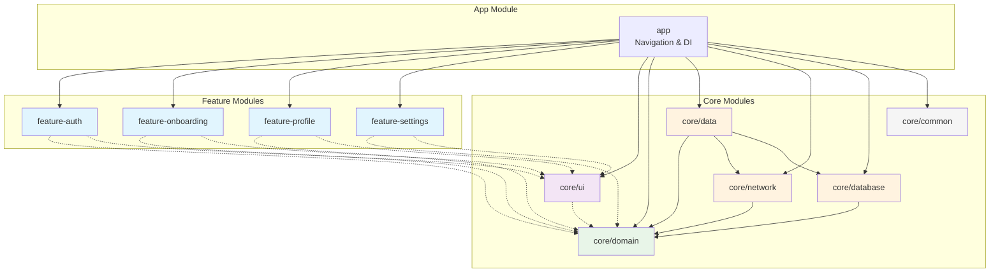

# Modularization

Multi-module Android setup with Navigation 3, Jetpack Compose, and strict dependency direction. All Kotlin code must align with `references/kotlin-patterns.md`.

Multi-module is **required** for any project beyond a single throwaway sample. Use it when:

- The project has 2+ user-facing features.
- Build times exceed 30s clean.
- More than one engineer ships changes in parallel.
- `core/domain` will be reused across product surfaces (app, Wear, TV).

## Table of Contents
1. [Existing project alignment](#existing-project-alignment)
2. [Module Types](#module-types)
3. [Module Structure](#module-structure)
4. [Dependency Rules](#dependency-rules)
5. [Creating Modules](#creating-modules)
6. [Navigation Coordination](#navigation-coordination)
7. [Build Configuration](#build-configuration)

## Existing project alignment

Required before adding modules or copying `assets/convention/` into an **existing** repo:

1. Read `settings.gradle.kts` (or `.gradle`) for `include(...)` names and `includeBuild("build-logic")`.
2. Skim one feature module `build.gradle.kts` and a representative `*ViewModel` / `*Screen` to detect Navigation 2 vs 3, Room 2 vs 3, XML vs Compose-only, and Hilt vs manual DI.
3. Match the project's module naming and dependency direction; open [migration.md](migration.md) when the repo lags skill defaults.

Forbidden:

- Copy `assets/convention/` into `build-logic/` when convention plugins already exist unless the user asked to adopt the convention plugins from `assets/convention/`.
- Add feature-to-feature dependencies that violate [Dependency Rules](#dependency-rules).

Version catalog and SDK pins: [dependencies.md → Existing project (brownfield)](dependencies.md#existing-project-brownfield).

## Build Configuration

Convention plugin definitions and examples live in:
- `assets/convention/` - All plugin source files (.kt)
- `references/gradle-setup.md` - Detailed build configuration patterns
- `assets/convention/QUICK_REFERENCE.md` - Setup instructions and examples

Copy plugin files from `assets/convention/` to `build-logic/convention/src/main/kotlin/` in your project.

## Module Types

### App Module (`app/`)
Entry point that brings everything together with Navigation3 adaptive navigation.

**Contains**:
- `MainActivity` with `NavigationSuiteScaffold`
- `AppNavigation` composable with `NavigationSuiteScaffold`
- `NavigationState` and `Navigator` for state management
- `entryProvider` with all feature destinations
- `NavDisplay` to render current destination
- `Navigator` implementations for feature coordination
- Hilt DI setup and component

**Dependencies**: All feature modules, all core modules

### Feature Modules (`feature/*`)
Self-contained features with clear boundaries and no inter-feature dependencies.
See [Feature Module Structure](#feature-module-structure) for the full directory layout.

### Core Modules (`core/`)
Shared library code used across features with strict dependency direction.

| Module           | Purpose                                         | Dependencies                                        | Key Classes                                                         |
|------------------|-------------------------------------------------|-----------------------------------------------------|---------------------------------------------------------------------|
| `core:domain`    | Domain models, use cases, repository interfaces | None (pure Kotlin)                                  | `AuthToken`, `User`, `LoginUseCase`, `AuthRepository` interface     |
| `core:data`      | Repository implementations, data coordination   | `core:domain`                                       | `AuthRepositoryImpl`, `AuthRemoteDataSource`, `AuthLocalDataSource` |
| `core:database`  | Room 3 database, DAOs, entities                 | `core:model` (if separate), otherwise `core:domain` | `AuthDatabase`, `AuthTokenDao`, `UserEntity`                        |
| `core:network`   | Retrofit API, network models                    | `core:model` (if separate), otherwise `core:domain` | `AuthApi`, `NetworkAuthResponse`                                    |
| `core:datastore` | Proto DataStore preferences                     | None                                                | `AuthPreferencesDataSource`                                         |
| `core:common`    | Shared utilities, extensions                    | None                                                | `AppDispatchers`, `ResultExtensions`                                |
| `core:ui`        | Reusable UI components, themes, base ViewModels | `core:domain` when composables read shared models     | `AuthForm`, `AuthTheme`, `BaseViewModel`                            |
| `core:testing`   | Test utilities, test doubles                    | Depends on module being tested                      | `TestDispatcherRule`, `FakeAuthRepository`                          |

## Module Structure

### Complete Project Structure

```
app/                    # App module - navigation, DI setup, app entry point
feature/
  ├── feature-auth/       # Authentication feature
  ├── feature-onboarding/ # Signup and onboarding flow
  ├── feature-profile/    # User profile feature
  ├── feature-settings/   # App settings feature
  └── feature-<name>/     # Additional features...
core/
  ├── domain/           # Pure Kotlin: Use Cases, Repository interfaces, Domain models
  ├── data/             # Data layer: Repository impl, DataSources, Data models
  ├── ui/               # Shared UI components, themes, base ViewModels
  ├── network/          # Retrofit, API models, network utilities
  ├── database/         # Room 3 DAOs, entities, migrations
  ├── datastore/        # Preferences storage
  ├── common/           # Shared utilities, extensions
  └── testing/          # Test utilities, test doubles
build-logic/            # Convention plugins for consistent builds
        ├── convention/
        │   ├── src/main/kotlin/
        │   │   ├── AndroidApplicationConventionPlugin.kt
        │   │   ├── AndroidApplicationComposeConventionPlugin.kt
        │   │   ├── AndroidApplicationBaselineProfileConventionPlugin.kt
        │   │   ├── AndroidApplicationJacocoConventionPlugin.kt
        │   │   ├── AndroidLibraryConventionPlugin.kt
        │   │   ├── AndroidLibraryComposeConventionPlugin.kt
        │   │   ├── AndroidLibraryJacocoConventionPlugin.kt
        │   │   ├── AndroidFeatureConventionPlugin.kt
        │   │   ├── AndroidTestConventionPlugin.kt
        │   │   ├── AndroidRoomConventionPlugin.kt
        │   │   ├── AndroidLintConventionPlugin.kt
        │   │   ├── HiltConventionPlugin.kt
        │   │   ├── DetektConventionPlugin.kt
        │   │   ├── SpotlessConventionPlugin.kt
        │   │   ├── JvmLibraryConventionPlugin.kt
        │   │   ├── KotlinSerializationConventionPlugin.kt
        │   │   ├── FirebaseConventionPlugin.kt
        │   │   ├── SentryConventionPlugin.kt
        │   │   └── config/
        │   │       ├── KotlinAndroid.kt
        │   │       ├── AndroidCompose.kt
        │   │       ├── ProjectExtensions.kt
        │   │       ├── GradleManagedDevices.kt
        │   │       ├── AndroidInstrumentationTest.kt
        │   │       ├── PrintApksTask.kt
        │   │       └── Jacoco.kt
        │   └── build.gradle.kts
```

### Feature Module Structure

```
feature-auth/
├── build.gradle.kts
├── src/main/
│   ├── kotlin/com/example/feature/auth/
│   │   ├── presentation/              # Presentation Layer
│   │   │   ├── AuthScreen.kt          # Main composable
│   │   │   ├── AuthRoute.kt           # Feature route composable
│   │   │   ├── viewmodel/             
│   │   │   │   ├── AuthViewModel.kt   # State holder
│   │   │   │   ├── AuthUiState.kt     # UI state models
│   │   │   │   └── AuthActions.kt     # User actions
│   │   │   └── components/            # Feature-specific UI components
│   │   │       ├── AuthFormCard.kt
│   │   │       └── AuthHeader.kt
│   │   ├── navigation/                # Navigation Layer
│   │   │   ├── AuthDestination.kt     # Feature routes (sealed class)
│   │   │   ├── AuthNavigator.kt       # Navigation interface
│   │   │   └── AuthGraph.kt           # NavGraphBuilder extension
│   │   └── di/                        # Feature-specific DI
│   │       └── AuthModule.kt          # Hilt module
│   └── res/                          # Feature resources
│       ├── drawable/
│       └── values/
└── src/test/                         # Feature tests
    └── kotlin/com/example/feature/auth/
        ├── presentation/viewmodel/
        │   └── AuthViewModelTest.kt
        └── navigation/
            └── AuthDestinationTest.kt
```

### Core Module Structure

```
core/domain/
├── build.gradle.kts
├── src/main/kotlin/com/example/core/domain/
│   ├── model/                         # Domain models
│   │   ├── User.kt
│   │   ├── AuthToken.kt
│   │   └── AuthState.kt
│   ├── repository/                    # Repository interfaces
│   │   └── AuthRepository.kt
│   ├── usecase/                       # Use cases
│   │   ├── LoginUseCase.kt
│   │   ├── RegisterUseCase.kt
│   │   ├── ResetPasswordUseCase.kt
│   │   └── ObserveAuthStateUseCase.kt
│   └── di/                           # Domain DI (if needed)
│       └── DomainModule.kt
└── src/test/kotlin/com/example/core/domain/
    ├── model/
    └── usecase/
```

## Dependency Rules

### Allowed Dependencies

```
feature/* → core/domain → core/data
    ↓                       ↓
core/ui (when shared UI exists)   (no circular dependencies)

app → all feature modules (for navigation coordination)
app → all core modules (for DI setup)

NO feature-to-feature dependencies allowed
```

### Strict Rules:
1. **Feature modules can only depend on Core modules**
2. **Feature modules cannot depend on other feature modules**
3. **Core/Domain has no Android dependencies** (pure Kotlin)
4. **Core/Data depends on Core/Domain** (implements interfaces)
5. **Core/UI** ships once multiple features share composables, themes, or base `ViewModel` chrome; presentation-only features can defer it until reuse appears
6. **App module depends on all features** for navigation coordination
7. **No circular dependencies** between any modules

### Visual Dependency Graph



## Creating Modules

### 1. Create Feature Module

**Step 1: Create directory structure**
```
mkdir -p feature-auth/src/main/kotlin/com/example/feature/auth/{presentation/{viewmodel,components},navigation,di}
mkdir -p feature-auth/src/test/kotlin/com/example/feature/auth
```

**Step 2: Configure build.gradle.kts**
Use the Feature Module build file template in `references/gradle-setup.md`.
It includes the feature convention plugins, core module dependencies, Navigation3,
and test bundles.

**Step 3: Register in settings.gradle.kts**
```kotlin
include(":feature-auth")
```

**Step 4: Create navigation components**
```kotlin
// feature-auth/navigation/AuthDestination.kt
import androidx.compose.runtime.Immutable
import androidx.navigation3.runtime.NavKey
import kotlinx.serialization.Serializable

@Immutable
sealed interface AuthDestination : NavKey {
    @Serializable
    data object Login : AuthDestination
    
    @Serializable
    data object Register : AuthDestination
    
    @Serializable
    data object ForgotPassword : AuthDestination
    
    @Serializable
    data class Profile(val userId: String) : AuthDestination
}

// feature-auth/navigation/AuthNavigator.kt
interface AuthNavigator {
    fun navigateToRegister()
    fun navigateToForgotPassword()
    fun navigateBack()
    fun navigateToProfile(userId: String)
    fun navigateToMainApp()
}

// feature-auth/navigation/AuthGraph.kt
import androidx.navigation3.runtime.EntryProviderScope
import androidx.navigation3.runtime.NavKey

fun EntryProviderScope<NavKey>.authGraph(
    authNavigator: AuthNavigator
) {
    entry<AuthDestination.Login> {
        LoginScreen(
            onLoginSuccess = { user ->
                authNavigator.navigateToMainApp()
            },
            onRegisterClick = {
                authNavigator.navigateToRegister()
            },
            onForgotPasswordClick = {
                authNavigator.navigateToForgotPassword()
            }
        )
    }
    
    entry<AuthDestination.Register> {
        RegisterScreen(
            onRegisterSuccess = { user ->
                authNavigator.navigateToMainApp()
            },
            onNavigateToLogin = {
                authNavigator.navigateBack()
            }
        )
    }
    
    entry<AuthDestination.ForgotPassword> {
        ForgotPasswordScreen(
            onResetSuccess = {
                authNavigator.navigateBack()
            },
            onNavigateBack = {
                authNavigator.navigateBack()
            }
        )
    }
    
    entry<AuthDestination.Profile> { key ->
        ProfileScreen(
            userId = key.userId,
            onNavigateBack = {
                authNavigator.navigateBack()
            }
        )
    }
}
```

### 2. Create Core Module

Required directory layout for a `core/domain` module:

```
core/domain/
  build.gradle.kts                                               # Apply Core Domain template from references/gradle-setup.md
  src/main/kotlin/com/example/core/domain/{model,repository,usecase}/
  src/test/kotlin/com/example/core/domain/
```

The build file applies the Core Domain template from `references/gradle-setup.md` (pure Kotlin + serialization + test deps). Domain models, repository interfaces, and use cases go under `core/domain`; pattern details: `references/architecture.md` → Domain Layer.

### 3. Create App Module Configuration

Required wiring in the `:app` module:

- `build.gradle.kts`: apply the App module template from `references/gradle-setup.md` (feature/core wiring, Navigation 3, Hilt).
- `NavigationState.kt` and `Navigator.kt`: see `references/android-navigation.md` → "Navigation 3 State Management".
- `AppNavigation.kt`: see `references/android-navigation.md` → "App Navigation Setup" (`NavigationSuiteScaffold`, `TopLevelRoute`, navigator implementations, icon resources).

## Navigation Coordination

For Navigation3 quick start, app navigation setup, state management (`NavigationState`, `Navigator`),
key principles, and migration guidance, see `references/android-navigation.md`.

## Build Configuration

Convention plugin definitions and examples live in `references/gradle-setup.md`
so all build logic stays centralized in one place.
